<h1 align="center">Hi , I'm Fanny</h1>
<h4 align="center">Just Web Developer.</h4>
<h3 align="center">i'm a fullstack developer, passionate about learning and collaboration, i'm currently looking for any new opportunities.</h3>

      

[//]: # ()
[//]: # (<a href="https://www.fanny.dev/">)

[//]: # ()
[//]: # (<picture>)

[//]: # ()
[//]: # (<source media="&#40;prefers-color-scheme: dark&#41;" srcset="./header-dark.svg">)

[//]: # ()
[//]: # (<source media="&#40;prefers-color-scheme: light&#41;" srcset="./header.svg" />)

[//]: # ()
[//]: # ()

[//]: # ()
[//]: # (</picture>)

[//]: # ()
[//]: # (</a>)

<header>
  

    
    
    
    
    
  

</header>

[//]: # ()
[//]: # (## 🙋‍♂️ About Me)

[//]: # ()
[//]: # (- 👀 I’m interested in web developer as a fullstack developer)

[//]: # (- 🏫 I’m currently learning at Politeknik Negeri Malang, Manajement Informatika, and **Web Development** )

[//]: # (- 🖥️ See my portfolio at [fanny.dev]&#40;https://fanny.dev/&#41;)

[//]: # (- 📫 you can contact via Gmail <a href="mailto:fannybagus9f@gmail.com?">fannybagus9f@gmail.com</a>)

[//]: # (- 🏦 I'm a Web Developer working for a PT.Jayahost in Indonesia)

[//]: # (<!-- - 💞️ I’m looking to collaborate on to improve my skills&#41; -->)

[//]: # (<!-- - 📄 Please have a look at my <a href="https://FannyDevz.showwcase.com/">resume</a> for more details about me. I'm open to feedback and suggestions!-->)

[//]: # (<!-- - 🧠 I'm learning NextJS and TailwindCSS. -->)

[//]: # ( )

## 🚀 Tech Stack and Tools:

        <!-- HTML -->
        
        <!-- CSS -->
        
        <!-- JavaScript -->
        
        <!-- Typescript -->
        
        <!-- PHP -->
        
        <!-- CodeIgniter -->
        
        <!-- Laravel -->
        
        <!-- React -->
        
        <!-- Bootstrap -->
        
        <!-- Tailwind -->
        
        <!-- Figma -->
        
        <!-- Illustrator -->
        
        <!-- Photoshop -->
        

 

[//]: # (## 📊 My Github Stats)

  
<h2>📊 My Github Stats</h2>

    

        
        
        
    

## 🐍 Eating away my contributions😭... Help!

<picture>
  <source media="(prefers-color-scheme: dark)" srcset="https://raw.githubusercontent.com/FannyDevz/FannyDevz/output/github-contribution-grid-snake-dark.svg">
  <source media="(prefers-color-scheme: light)" srcset="https://raw.githubusercontent.com/FannyDevz/FannyDevz/output/github-contribution-grid-snake.svg">
  
</picture>
 
 

[//]: # (
<b>Note:</b> Top languages is <b>only a metric</b> of the languages my <b>public code</b> consists of and <b>doesn't reflect</b> experience or <b>skill level</b>.
)
[//]: # ( )

    

